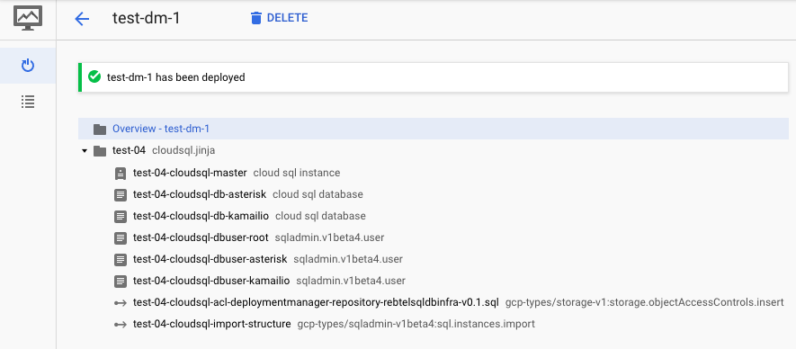

# Cloud SQL template

## Overview

This is a [Google Cloud Deployment Manager](https://cloud.google.com/deployment-manager/overview) template that
deploys a Cloud SQL Master instance and create a list of databases and users. I also use a DM `action` to
import structure to the instance from Google Storage bucket.



> Note, CloudSQL does not allow parallel updates to the User, Databases table.

## Prerequsites

You need to have write permission to sqlimport bucket, the template will take care of adding the READER permission to the sql file in your bucket.

You need to grant 

- [roles/cloudsql.admin](https://cloud.google.com/iam/docs/understanding-roles#sql_name_short_roles)  role
to the service account DM uses (```projectNumber@cloudservices.gserviceaccount.com```)

## Deploy the template

Use `cloudsql.yaml` to deploy this example template. When ready, deploy with the following command:

```
gcloud deployment-manager deployments create test-deployment --config cloudsql.yaml
```

**`cloudsql.yaml`**

```
#
#  title: CloudSQL
#  author: osm.hammami@gmail.com
#  description: |
#    Creates a CloudSQL deployment
#  version: 0.2

imports:
  - path: cloudsql.jinja

resources:
  - name: test-deployment
    type: cloudsql.jinja
    properties:
      cloudsql:
        databaseVersion: MYSQL_5_7
        region: europe-west3
        tier: db-f1-micro
        dataDiskSizeGb: 10
        dataDiskType: PD_SSD
        zone: europe-west3-a
        backupStartTime: 09:00
        privateNetwork: default
        authorizedNetworks:
        - name: home-network
          value: 192.168.1.1/32
      sqlimport:
        bucket: bucket-repository
        file: sql-dump.sql
      failover: false
      databases:
      - name: db1
        charset: utf8
      - name: db2
        charset: utf8
      dbusers:
      - user: root
        host: '%'
        password: mySuperSafePassword
      - user: user1
        host: '%'
        password: mySuperSafePassword
      - user: user2
        host: '%'
        password: mySuperSafePassword
      databaseFlags:
      - name: log_bin_trust_function_creators
        value: 'On'
      - name: default_time_zone
        value: '+00:00'
```

### Deployment

```
# gcloud deployment-manager deployments create test-dm-1 --config cloudsql.yaml
The fingerprint of the deployment is 2-XXXXXXXXXXXXXXXX
Waiting for update [operation-XXXXXXXXXXX-XXXXXXX-XXXXXXXX]...done.
Update operation operation-XXXXXXXXXXX-XXXXXXX-XXXXXXXX completed successfully.
NAME                                                                         TYPE                                                      STATE      ERRORS  INTENT
test-04-cloudsql-acl-deploymentmanager-repository-rebtelsqldbinfra-v0.1.sql  gcp-types/storage-v1:storage.objectAccessControls.insert  COMPLETED  []
test-04-cloudsql-db-asterisk                                                 sqladmin.v1beta4.database                                 COMPLETED  []
test-04-cloudsql-db-kamailio                                                 sqladmin.v1beta4.database                                 COMPLETED  []
test-04-cloudsql-dbuser-asterisk                                             sqladmin.v1beta4.user                                     COMPLETED  []
test-04-cloudsql-dbuser-kamailio                                             sqladmin.v1beta4.user                                     COMPLETED  []
test-04-cloudsql-dbuser-root                                                 sqladmin.v1beta4.user                                     COMPLETED  []
test-04-cloudsql-import-structure                                            gcp-types/sqladmin-v1beta4:sql.instances.import           COMPLETED  []
test-04-cloudsql-master                                                      sqladmin.v1beta4.instance                                 COMPLETED  []
```

